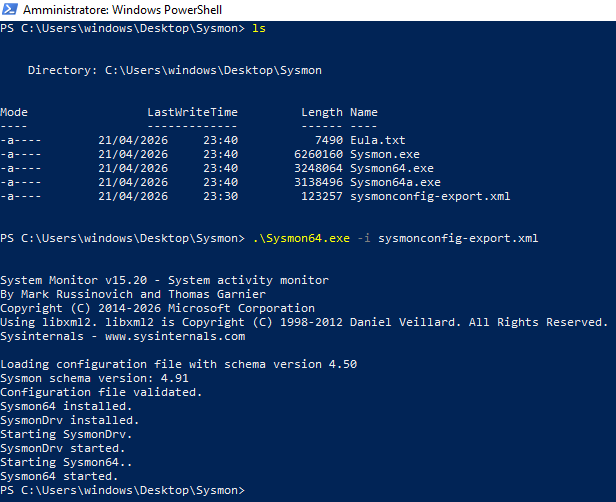

This is a Windows system service and that logs system activity to the Windows event log, providing detailed information about process creations, network connections, and file creation time changes. It helps in identifying malicious or anomalous activity by collecting and analyzing these events.

Installed the zip from the official site: https://learn.microsoft.com/en-us/sysinternals/downloads/sysmon

Installed the xml configuration file from: https://github.com/SwiftOnSecurity/sysmon-config/blob/master/sysmonconfig-export.xml

Extracted the folder, put the .conf file inside of it.
Now on powershell with admin privilege,  in the Sysmon folder, I installed Sysmon with the configuration file that we chose:

`.\Sysmon64.exe -i sysmonconfig-export.xml`

