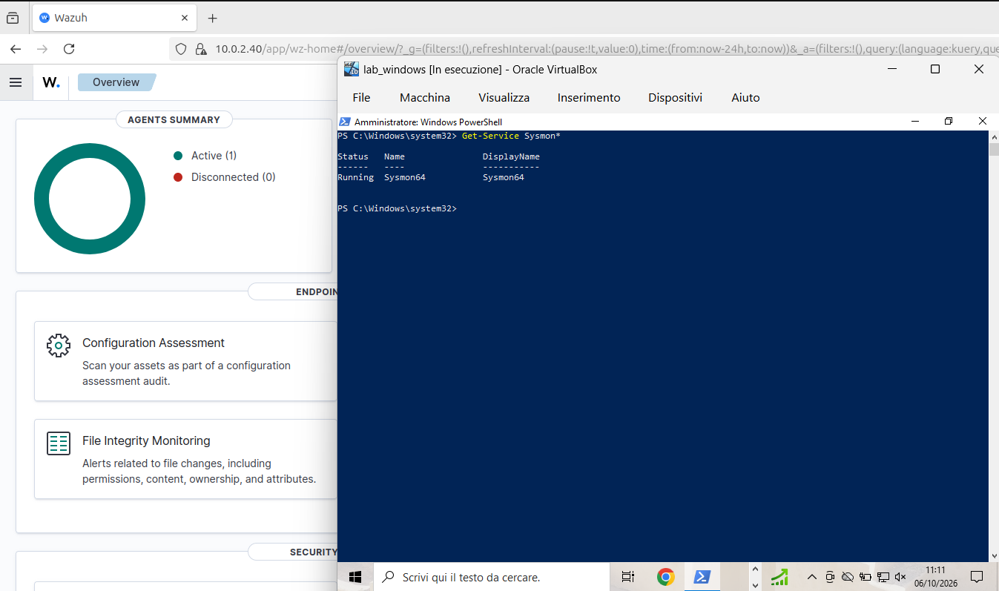

### Installation

First of all, make sure you don’t have any pending updates, so:
`sudo apt update && sudo apt upgrade -y`

Then I installed curl:
`sudo apt install curl`

Install the latest java jdk:
`sudo apt install default-jdk -y`

I installed Wazuh on the Ubuntu machine:
`curl -sO https://packages.wazuh.com/4.14/wazuh-install.sh`
`bash wazuh-install.sh -a`

Important to save:

- A backup of the internal users has been saved in the `/etc/wazuh-indexer/internalusers-backup` folder
- User: `admin`
  Password: `nqLglTl8Q0Hawj4DzrL0kJIspM1Qx77.`

Created a Winows agent and started it on the Windows machine
`NET START WazuhSvc`

To ingest granular telemetry for detection engineering and threat hunting, the agent must be configured to forward events from the dedicated Sysmon channel:
1. Open the agent configuration file with administrative privileges:
	`notepad.exe "C:\Program Files (x86)\ossec-agent\ossec.conf"`
2. Inside the `<ossec_config>` section, append a new `<localfile>` block targeting the Sysmon operational channel via the modern Windows Event Log API
	`<localfile>` `<location>Microsoft-Windows-Sysmon/Operational</location>` `<log_format>eventchannel</log_format>` `</localfile>`
3. Restart the Wazuh agent service via PowerShell to apply the changes:
	`Restart-Service WazuhSvc`

